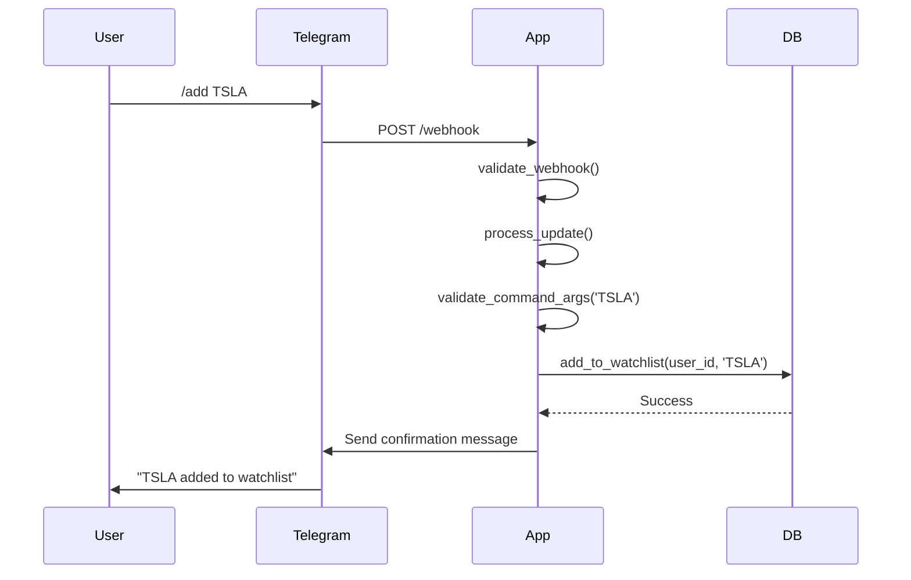

# API Documentation

Comprehensive API reference for the Stock Alerts application. All endpoints are implemented using Flask blueprints in the [`routes/`](../routes/) directory.

## 📊 Stock Data API

Public endpoints for fetching stock market data and analytics, consumed by the web dashboard ([`static/js/main.js`](../static/js/main.js)).

### `GET /data/<ticker>/<period>`

Retrieves historical stock price data with 200-day moving average analysis and statistical percentiles.

**Implementation:** [`routes/api_routes.py:get_stock_data()`](../routes/api_routes.py)  
**Business Logic:** [`services/stock_service.py:calculate_metrics()`](../services/stock_service.py)  
**Data Source:** [`utils/tiingo_client.py:fetch_historical_data()`](../utils/tiingo_client.py)

#### Parameters
| Parameter | Type | Required | Description | Validation |
|-----------|------|----------|-------------|------------|
| `ticker` | string | ✅ | Stock symbol (e.g., `AAPL`, `TSLA`) | [`utils/validators.py:validate_ticker_symbol()`](../utils/validators.py) |
| `period` | string | ✅ | Time period: `1y`, `3y`, `5y`, `max` | [`utils/validators.py:validate_period()`](../utils/validators.py) |

#### Authentication
**None required** - Public endpoint

#### Response Format

**Success (200 OK):**
```json
{
  "dates": ["2022-01-01", "2022-01-02", "..."],
  "prices": [150.0, 151.5, 152.1],
  "ma_200": [null, null, 145.0, 145.2],
  "pct_diff": [null, null, 3.4, 4.3],
  "percentiles": {
    "p16": -10.5,
    "p84": 12.8
  },
  "previous_close": 149.75
}
```

**Error Responses:**
```json
// 400 Bad Request - Invalid ticker
{"error": "Invalid ticker symbol: INVALID"}

// 400 Bad Request - Invalid period  
{"error": "Invalid period: 10y"}

// 404 Not Found - No data available
{"error": "No data available for this ticker symbol"}

// 500 Internal Server Error
{"error": "Unable to fetch stock data. Please try again later."}
```

#### Data Processing
1. **Cache Check:** [`db_manager.py:get_fresh_cache()`](../db_manager.py) (1-hour TTL)
2. **API Fetch:** [`utils/tiingo_client.py`](../utils/tiingo_client.py) if cache miss
3. **Calculations:** 200-day MA, percentage deviation, 16th/84th percentiles
4. **Cache Update:** [`db_manager.py:update_stock_cache()`](../db_manager.py)

#### Usage Example
```javascript
// Frontend usage (from static/js/main.js)
fetch('/data/AAPL/5y')
  .then(response => response.json())
  .then(data => {
    // Render ApexCharts with data.dates, data.prices, etc.
  });
```

### `GET /trading-stats/<ticker>/<period>`

Advanced trading intelligence with fear/greed analysis, alert patterns, and opportunity scoring.

**Implementation:** [`routes/api_routes.py:get_trading_stats()`](../routes/api_routes.py)  
**Business Logic:** [`services/stock_service.py:calculate_trading_stats()`](../services/stock_service.py)  
**Data Dependency:** Uses output from `calculate_metrics()` for statistical analysis

#### Parameters
Identical to `/data/<ticker>/<period>` endpoint

#### Authentication
**None required** - Public endpoint

#### Response Format

**Success (200 OK):**
```json
{
  "symbol": "AAPL",
  "period": "5y",
  "analysis_period": {
    "start_date": "2019-01-01",
    "end_date": "2024-01-01", 
    "total_days": 1826
  },
  "alert_analysis": {
    "total_alerts": 235,
    "extreme_fear_alerts": 120,
    "extreme_greed_alerts": 115,
    "alert_frequency": "12.9%"
  },
  "zone_analysis": {
    "fear_zone": {
      "days": 120,
      "percentage": "6.6%",
      "avg_price": 150.10,
      "avg_duration": 2.3,
      "max_duration": 12
    },
    "greed_zone": {
      "days": 115, 
      "percentage": "6.3%",
      "avg_price": 185.45,
      "avg_duration": 2.1,
      "max_duration": 8
    },
    "neutral_zone": {
      "days": 1591,
      "percentage": "87.1%",
      "avg_price": 167.89
    }
  },
  "current_analysis": {
    "price": 175.20,
    "zone": "neutral",
    "pct_from_ma200": 4.2,
    "opportunity_score": 62.5
  },
  "opportunity_insights": {
    "vs_fear_avg": 16.7,
    "vs_greed_avg": -5.5,
    "vs_neutral_avg": 4.4
  }
}
```

#### Key Metrics Explained

**Alert Analysis:**
- **total_alerts**: Count of price movements beyond 16th/84th percentiles
- **alert_frequency**: Percentage of trading days with extreme movements

**Zone Analysis:**
- **Fear Zone**: Price below 16th percentile (oversold conditions)
- **Greed Zone**: Price above 84th percentile (overbought conditions)  
- **Neutral Zone**: Price between percentiles (normal trading)
- **avg_duration**: Average consecutive days in each zone

**Opportunity Score:**
- **Algorithm**: Calculated in [`services/stock_service.py:calculate_trading_stats()`](../services/stock_service.py)
- **Range**: 0-100 (higher = better opportunity based on historical patterns)
- **Factors**: Current price vs historical zone averages, time in zones

#### Usage Example
```javascript
// Frontend usage for trading intelligence dashboard
fetch('/trading-stats/TSLA/3y')
  .then(response => response.json())
  .then(stats => {
    displayOpportunityScore(stats.current_analysis.opportunity_score);
    renderZoneAnalysis(stats.zone_analysis);
  });
```

## 🤖 Telegram Bot API

Webhook endpoint for processing Telegram bot interactions and commands.

### `POST /webhook`

Receives and processes updates from Telegram Bot API when users interact with the bot.

**Implementation:** [`routes/webhook_routes.py:telegram_webhook()`](../routes/webhook_routes.py)  
**Business Logic:** [`webhook_handler.py:WebhookHandler`](../webhook_handler.py)  
**Command Processing:** [`webhook_handler.py:process_update()`](../webhook_handler.py)

#### Request Format

**Headers:**
```
Content-Type: application/json
X-Telegram-Bot-Api-Secret-Token: <webhook_secret>
```

**Body (Telegram Update Object):**
```json
{
  "update_id": 123456789,
  "message": {
    "message_id": 456,
    "from": {
      "id": 987654321,
      "first_name": "John",
      "username": "johndoe"
    },
    "chat": {
      "id": 987654321,
      "type": "private"
    },
    "date": 1640995200,
    "text": "/add AAPL"
  }
}
```

#### Authentication & Security

**Webhook Validation:** [`webhook_handler.py:validate_webhook()`](../webhook_handler.py)
- **HMAC Verification**: Timing-safe comparison of `X-Telegram-Bot-Api-Secret-Token`
- **JSON Validation**: Ensures valid Telegram update structure
- **Required Fields**: Validates presence of `update_id` and message data

#### Response Codes

| Code | Description | Condition |
|------|-------------|------------|
| `200 OK` | Update processed successfully | Valid webhook, command executed |
| `403 Forbidden` | Webhook validation failed | Invalid secret token or malformed request |
| `503 Service Unavailable` | Service temporarily unavailable | WebhookHandler not initialized |

#### Supported Bot Commands

Processed by [`webhook_handler.py:_handle_command()`](../webhook_handler.py):

| Command | Description | Database Operation |
|---------|-------------|-------------------|
| `/start` | Initialize user account | [`db_manager.py:add_user()`](../db_manager.py) |
| `/add <ticker>` | Add stock to watchlist | [`db_manager.py:add_to_watchlist()`](../db_manager.py) |
| `/remove <ticker>` | Remove stock from watchlist | [`db_manager.py:remove_from_watchlist()`](../db_manager.py) |
| `/list` | Show current watchlist | [`db_manager.py:get_watchlist()`](../db_manager.py) |
| `/help` | Display available commands | No database operation |

#### Command Validation

**Input Sanitization:** [`utils/validators.py:validate_command_args()`](../utils/validators.py)
- **Ticker Symbol**: Alphanumeric, 1-5 characters, uppercase conversion
- **SQL Injection Prevention**: Parameterized queries only
- **Rate Limiting**: Per-user command throttling

#### Example Command Flow



#### Webhook Setup

Use [`setup_webhook.py`](../setup_webhook.py) for configuration:

```bash
# Interactive webhook setup
python setup_webhook.py

# Manual API call
curl -X POST "https://api.telegram.org/bot<TOKEN>/setWebhook" \
  -H "Content-Type: application/json" \
  -d '{
    "url": "https://yourdomain.com/webhook",
    "secret_token": "your_webhook_secret"
  }'
```

## 🛡️ Admin & System API

Administrative endpoints for system monitoring, health checks, and manual operations.

### `GET /health`

System health check endpoint for monitoring and load balancer integration.

**Implementation:** [`routes/health_routes.py:health_check()`](../routes/health_routes.py)  
**Dependencies:** Database connection verification via [`app.db_manager`](../app.py)

#### Authentication
**None required** - Public monitoring endpoint

#### Response Format

**Healthy System (200 OK):**
```json
{"status": "healthy"}
```

**Unhealthy System (500 Internal Server Error):**
```json
{
  "status": "unhealthy",
  "error": "Database manager not initialized"
}
```

#### Usage
```bash
# Health check for monitoring
curl http://localhost:5001/health

# Docker/Kubernetes health probe
WORDHEALTHCHECK --interval=30s --timeout=3s --start-period=5s --retries=3 \
  CMD curl -f http://localhost:5001/health || exit 1
```

---

### `GET /admin`

Web-based admin dashboard for database inspection and system monitoring.

**Implementation:** [`routes/admin_routes.py:admin_panel()`](../routes/admin_routes.py)  
**Template:** [`templates/admin.html`](../templates/admin.html)  
**Data Provider:** [`services/admin_service.py:get_admin_data()`](../services/admin_service.py)

#### Authentication
**HTTP Basic Authentication** - Required  
**Credentials:** `ADMIN_USERNAME` and `ADMIN_PASSWORD` environment variables  
**Implementation:** [`services/auth_service.py:require_admin_auth()`](../services/auth_service.py)

#### Response
HTML admin panel displaying:
- **Users Table**: Telegram user accounts and settings
- **Watchlist Items**: Active stock watchlists by user
- **Stock Cache**: Cached API data and timestamps  
- **Alert History**: Sent alerts and delivery status
- **System Logs**: Recent application events

#### Usage
```bash
# Access admin panel
curl -u admin:password http://localhost:5001/admin

# Browser access with authentication prompt
open http://localhost:5001/admin
```

---

### `POST /admin/check`

Manually trigger the periodic stock check process for testing or external automation.

**Implementation:** [`routes/admin_routes.py:trigger_stock_check()`](../routes/admin_routes.py)  
**Business Logic:** [`services/admin_service.py:trigger_stock_check()`](../services/admin_service.py)  
**Background Process:** [`periodic_checker.py:PeriodicChecker.check_watchlists()`](../periodic_checker.py)

#### Authentication
**API Key Required** - `X-API-Key` header  
**Key Source:** `ADMIN_API_KEY` environment variable  
**Validation:** [`services/auth_service.py:validate_admin_api_key()`](../services/auth_service.py)

#### Request Format
```bash
POST /admin/check
X-API-Key: your_admin_api_key_here
Content-Type: application/json
```

#### Response Format

**Success (200 OK):**
```json
{
  "status": "success",
  "message": "Stock check completed successfully",
  "stats": {
    "watchlists_checked": 25,
    "alerts_sent": 3,
    "execution_time": "2.34s"
  }
}
```

**Authentication Errors:**
```json
// 401 Unauthorized - Missing API key
{"status": "error", "message": "API key required"}

// 401 Unauthorized - Invalid API key  
{"status": "error", "message": "Unauthorized"}
```

**Service Errors:**
```json
// 500 Internal Server Error
{"status": "error", "message": "Stock check failed: <error_details>"}
```

#### Usage Examples

```bash
# Manual stock check trigger
curl -X POST http://localhost:5001/admin/check \
  -H "X-API-Key: your_admin_api_key" \
  -H "Content-Type: application/json"

# External scheduler integration (cron, GitHub Actions)
*/30 * * * * curl -X POST https://yourdomain.com/admin/check -H "X-API-Key: $ADMIN_API_KEY"
```

#### Security Considerations
- **API Key Storage**: Store in environment variables, never in code
- **Rate Limiting**: Manual triggers should be throttled to prevent abuse
- **Logging**: All admin operations are logged via [`db_manager.py:log_event()`](../db_manager.py)

---

## 🔒 Authentication Summary

| Endpoint | Auth Type | Credential Source | Security Level |
|----------|-----------|------------------|----------------|
| `/data/*` | None | Public | 🟢 Low |
| `/trading-stats/*` | None | Public | 🟢 Low |
| `/webhook` | HMAC | `TELEGRAM_WEBHOOK_SECRET` | 🟡 Medium |
| `/health` | None | Public | 🟢 Low |
| `/admin` | HTTP Basic | `ADMIN_USERNAME`/`ADMIN_PASSWORD` | 🔴 High |
| `/admin/check` | API Key | `ADMIN_API_KEY` | 🔴 High |

---

## 📊 Rate Limiting & Caching

### Stock Data Caching
- **Cache Duration**: 1 hour (configurable via `CACHE_HOURS`)
- **Cache Storage**: PostgreSQL `stock_cache` table
- **Cache Key**: Stock symbol
- **Implementation**: [`db_manager.py:get_fresh_cache()`](../db_manager.py)

### API Rate Limiting
- **Tiingo API**: Respects provider rate limits with delay
- **Request Delay**: 3 seconds (configurable via `TIINGO_REQUEST_DELAY`)
- **Implementation**: [`utils/tiingo_client.py`](../utils/tiingo_client.py)

### Request Logging
All API requests are logged with:
- Client IP address (via `request.environ.get('HTTP_X_FORWARDED_FOR')`)
- Request parameters and validation results
- Response status and timing
- Error details for debugging