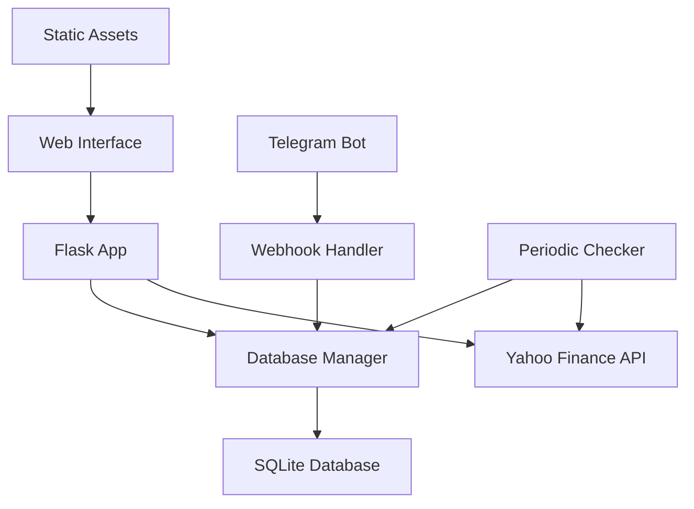

# Stock Alerts System Architecture

Comprehensive technical architecture documentation for the Stock Analytics Dashboard and Telegram Alert system.

## System Overview

The Stock Alerts system is a multi-component Python application built with Flask, SQLite, and the Telegram Bot API. It provides real-time stock analysis through a web interface and intelligent alerting via Telegram bot.

### High-Level Architecture



## Core Components

### 1. Flask Web Application (`app.py`)

The main application server handling HTTP requests and API endpoints.

#### Key Functions

**Application Initialization** [`app.py:1-74`](./app.py#L1-74)
```python
# Directory setup and environment loading
setup_directories()  # Line 7-12
load_dotenv('.env')  # Line 5

# Flask app configuration
app = Flask(__name__)
app.json_encoder = CustomJSONEncoder  # Line 67
CORS(app)  # Line 68
```

**Stock Data Processing** [`app.py:calculate_metrics()`](./app.py#L109-221)
- **Caching Strategy**: 1-hour cache via [`db_manager.get_fresh_cache()`](./db_manager.py#L247)
- **Rate Limiting**: Exponential backoff via [`fetch_yahoo_data_with_retry()`](./app.py#L75)
- **Technical Analysis**: 200-day MA and percentile calculations
- **Error Recovery**: Comprehensive exception handling

**API Endpoints**
- **`GET /`**: Dashboard interface [`app.py:index()`](./app.py#L223-225)
- **`GET /data/<ticker>/<period>`**: Stock data API [`app.py:get_stock_data()`](./app.py#L231-235)
- **`POST /webhook`**: Telegram webhook [`app.py:telegram_webhook()`](./app.py#L237-245)
- **`GET /health`**: Health monitoring [`app.py:health_check()`](./app.py#L247-255)

#### Technical Implementation Details

**Custom JSON Encoder** [`app.py:CustomJSONEncoder`](./app.py#L46-55)
```python
class CustomJSONEncoder(json.JSONEncoder):
    """Handles NaN/Infinity values and numpy types"""
    def default(self, obj):
        if isinstance(obj, np.generic):
            return obj.item()
        if pd.isna(obj):
            return None
```

**Rate Limiting Logic** [`app.py:fetch_yahoo_data_with_retry()`](./app.py#L75-107)
- **Exponential Backoff**: 2, 4, 8 second delays
- **YF Rate Limit Handling**: Specific exception handling for `YFRateLimitError`
- **Retry Strategy**: Up to 3 attempts with progressive delays

### 2. Database Management (`db_manager.py`)

Comprehensive database abstraction layer with connection management and migrations.

#### Architecture Patterns

**Connection Management** [`db_manager.py:_managed_cursor()`](./db_manager.py#L28-42)
```python
@contextmanager
def _managed_cursor(self, commit=False):
    """Context manager for safe database operations"""
    conn = self._get_connection()
    cursor = conn.cursor()
    try:
        yield cursor
        if commit:
            conn.commit()
    except sqlite3.Error as e:
        conn.rollback()
        raise
    finally:
        conn.close()
```

**Migration System** [`db_manager.py:initialize_database()`](./db_manager.py#L44-95)
- **Schema Versioning**: Tracks applied migrations in `migrations` table
- **Transactional Migrations**: Each migration runs in a transaction
- **Rollback Safety**: Automatic rollback on migration failures
- **File-based Migrations**: SQL files in [`migrations/`](./migrations/) directory

#### Key Operations

**Data Access Patterns**
- **User Management**: [`add_user()`](./db_manager.py#L97), [`get_watchlist()`](./db_manager.py#L148)
- **Watchlist Operations**: [`add_to_watchlist()`](./db_manager.py#L112), [`remove_from_watchlist()`](./db_manager.py#L135)
- **Caching Layer**: [`update_stock_cache()`](./db_manager.py#L164), [`get_fresh_cache()`](./db_manager.py#L247)
- **Alert History**: [`add_alert_history()`](./db_manager.py#L205), [`get_active_watchlists()`](./db_manager.py#L220)

**Performance Optimizations**
- **Connection Pooling**: Context managers for efficient connection usage
- **Prepared Statements**: Parameterized queries preventing SQL injection
- **Strategic Indexing**: Database indexes on frequently queried columns

### 3. Telegram Bot Integration (`webhook_handler.py`)

Secure webhook-based Telegram bot with command processing and alert delivery.

#### Security Architecture

**Webhook Validation** [`webhook_handler.py:validate_webhook()`](./webhook_handler.py#L24-44)
```python
def validate_webhook(self, request_data, secret_token_header):
    """HMAC-based webhook validation"""
    if self.secret_token:
        if not hmac.compare_digest(self.secret_token, secret_token_header):
            return False
    # Additional JSON validation...
```

**Message Processing Pipeline** [`webhook_handler.py:process_update()`](./webhook_handler.py#L46-79)
1. **Update Validation**: JSON structure and required fields
2. **User Registration**: Automatic user creation/update
3. **Command Routing**: Dispatch to appropriate handlers
4. **Error Handling**: Comprehensive exception management
5. **Audit Logging**: Event tracking via [`db_manager.log_event()`](./db_manager.py#L183)

#### Command System

**Command Handlers**
- **`/start`**: Welcome message [`_get_welcome_message()`](./webhook_handler.py#L103-112)
- **`/add`**: Watchlist management [`_handle_add_command()`](./webhook_handler.py#L177-197)
- **`/remove`**: Stock removal [`_handle_remove_command()`](./webhook_handler.py#L199-212)
- **`/list`**: Watchlist display [`_handle_list_command()`](./webhook_handler.py#L164-175)

**Alert System** [`webhook_handler.py:send_alert()`](./webhook_handler.py#L127-162)
```python
def send_alert(self, user_id, symbol, price, percentile, percentile_5, percentile_95):
    """Intelligent alert formatting and delivery"""
    # Context-aware message formatting
    # Historical percentile comparison
    # Delivery confirmation and error handling
    # Alert history tracking
```

### 4. Periodic Monitoring (`periodic_checker.py`)

Automated watchlist monitoring and alert triggering system.

#### Processing Architecture

**Batch Processing Strategy** [`periodic_checker.py:check_watchlists()`](./periodic_checker.py#L23-49)
```python
# Group users by symbol for efficient API usage
symbol_user_map = defaultdict(list)
for item in watchlists:
    symbol_user_map[item['symbol']].append(item['user_id'])

# Process each symbol once for all interested users
for symbol, user_ids in symbol_user_map.items():
    self._process_symbol(symbol, user_ids)
```

**Data Fetching with Resilience** [`periodic_checker.py:_fetch_symbol_data_with_retry()`](./periodic_checker.py#L51-82)
- **Exponential Backoff**: 5, 10, 20 second delays (longer for batch processing)
- **Rate Limit Handling**: Specific `YFRateLimitError` handling
- **Graceful Degradation**: Continues processing other symbols on individual failures

**Alert Logic** [`periodic_checker.py:_process_symbol()`](./periodic_checker.py#L84-167)
1. **Cache Check**: Attempt to use recent cached data (2-hour tolerance)
2. **Data Fetching**: Yahoo Finance API with retry logic
3. **Technical Analysis**: 200-day MA and percentile calculations
4. **Threshold Evaluation**: 16th/84th percentile comparison (1σ)
5. **Alert Delivery**: Telegram notification via `webhook_handler`
6. **History Tracking**: Alert logging and user notification timestamps

## Database Schema Architecture

### Entity Relationship Design

The database schema ([`migrations/001_initial.sql`](./migrations/001_initial.sql)) implements a normalized relational structure:

#### Core Tables

**Users** [`migrations/001_initial.sql:4-16`](./migrations/001_initial.sql#L4-16)
```sql
CREATE TABLE users (
    id TEXT PRIMARY KEY,                    -- Telegram user ID
    name TEXT NOT NULL,                     -- Display name
    notification_enabled BOOLEAN DEFAULT TRUE,
    preferred_check_day TEXT DEFAULT 'sunday',
    max_stocks INTEGER DEFAULT 20,
    -- Constraints and indexes for notification scheduling
);
```

**Watchlist Items** [`migrations/001_initial.sql:22-36`](./migrations/001_initial.sql#L22-36)
```sql
CREATE TABLE watchlist_items (
    user_id TEXT,
    symbol TEXT,
    alert_threshold_low REAL DEFAULT 16.0,   -- 16th percentile
    alert_threshold_high REAL DEFAULT 84.0, -- 84th percentile
    PRIMARY KEY (user_id, symbol),
    FOREIGN KEY (user_id) REFERENCES users(id)
);
```

**Stock Cache** [`migrations/001_initial.sql:43-50`](./migrations/001_initial.sql#L43-50)
```sql
CREATE TABLE stock_cache (
    symbol TEXT PRIMARY KEY,
    last_check TIMESTAMP NOT NULL,          -- Cache invalidation
    ma_200 REAL,                           -- 200-day moving average
    last_price REAL,                       -- Current price
    data_json TEXT,                        -- Serialized percentile data
);
```

#### Performance Indexes

**Strategic Indexing** [`migrations/001_initial.sql`](./migrations/001_initial.sql)
- **Notification Queries**: `idx_users_notification` on `(notification_enabled, preferred_check_day, preferred_check_time)`
- **Watchlist Lookups**: `idx_watchlist_symbol`, `idx_watchlist_user`
- **Cache Invalidation**: `idx_cache_check` on `last_check`
- **Alert History**: `idx_alert_user`, `idx_alert_symbol`, `idx_alert_time`

#### Data Integrity

**Constraint Enforcement**
- **Foreign Keys**: Referential integrity between users and watchlists
- **Check Constraints**: Data validation (e.g., `valid_thresholds`, `valid_price`)
- **Composite Keys**: Natural primary keys for many-to-many relationships

### View Architecture

**Active Watchlists View** [`migrations/001_initial.sql:108-121`](./migrations/001_initial.sql#L108-121)
```sql
CREATE VIEW active_watchlists AS
SELECT 
    w.user_id, u.name as user_name, w.symbol,
    w.alert_threshold_low, w.alert_threshold_high,
    sc.last_price, sc.ma_200
FROM watchlist_items w
JOIN users u ON w.user_id = u.id
LEFT JOIN stock_cache sc ON w.symbol = sc.symbol
WHERE u.notification_enabled = TRUE;
```

## Frontend Architecture

### Technology Stack

**Web Interface** [`templates/index.html`](./templates/index.html)
- **Framework**: Vanilla HTML5 with Progressive Enhancement
- **Charting**: Plotly.js CDN ([`index.html:7`](./templates/index.html#L7))
- **Styling**: Custom CSS with CSS Grid and Flexbox
- **Interactions**: TypeScript compiled to JavaScript

**JavaScript Architecture** [`static/js/main.js`](./static/js/main.js)

#### Key Components

**Chart Management** [`main.js:initializeCharts()`](./static/js/main.js#L71-159)
```javascript
// Dual-chart synchronized interaction
// Main chart: Price and 200-day MA
// Sub chart: Percentage difference with percentile bands
```

**Data Processing** [`main.js:updateCharts()`](./static/js/main.js#L173-306)
- **Null Value Filtering**: [`filterNullValues()`](./static/js/main.js#L162-171)
- **Dynamic Color Coding**: Green/red based on price movement
- **Synchronized Hover**: Cross-chart interaction
- **Responsive Layout**: Automatic resizing

**API Integration** [`main.js:fetchData()`](./static/js/main.js#L418-442)
```javascript
async function fetchData() {
    const response = await fetch(`/data/${currentTicker}/${selectedPeriod}`);
    const result = await response.json();
    // Error handling and chart updates
}
```

## Data Flow Architecture

### Request Processing Flow

#### Web Dashboard Flow
1. **User Input**: Ticker symbol and period selection
2. **API Request**: `/data/<ticker>/<period>` endpoint
3. **Cache Check**: [`db_manager.get_fresh_cache()`](./db_manager.py#L247) (1-hour TTL)
4. **Data Fetching**: Yahoo Finance API with retry logic
5. **Technical Analysis**: Moving average and percentile calculations
6. **Response Generation**: JSON payload with chart data
7. **Frontend Rendering**: Plotly.js chart updates

#### Alert Processing Flow
1. **Scheduled Execution**: Cron job triggers [`periodic_checker.py`](./periodic_checker.py)
2. **Watchlist Query**: Active users and symbols from database
3. **Symbol Grouping**: Efficient API usage via batch processing
4. **Data Analysis**: Technical indicators and threshold evaluation
5. **Alert Triggering**: Telegram message delivery
6. **History Logging**: Alert audit trail and user timestamps

### Caching Strategy

**Multi-Level Caching**
- **Application Cache**: In-memory data structures
- **Database Cache**: SQLite `stock_cache` table with TTL
- **API Rate Limiting**: Intelligent request spacing

**Cache Invalidation**
- **Time-based**: 1-hour for web requests, 2-hour for periodic checks
- **Event-based**: Manual cache clearing on data quality issues
- **Graceful Degradation**: Serve stale data during API outages

## Security Architecture

### Authentication & Authorization

**Telegram Bot Security**
- **Webhook Validation**: HMAC verification with secret token
- **User Registration**: Automatic provisioning with rate limiting
- **Command Authorization**: User-based access control

**Web Application Security**
- **CORS Configuration**: Controlled cross-origin access
- **Input Validation**: Ticker symbol sanitization
- **Error Handling**: Information leakage prevention

### Data Protection

**Database Security**
- **Parameterized Queries**: SQL injection prevention
- **Connection Security**: Timeout and connection pooling
- **Audit Logging**: Comprehensive event tracking

**API Security**
- **Rate Limiting**: Exponential backoff and request throttling
- **Error Boundaries**: Graceful degradation
- **Monitoring**: Health checks and error tracking

## Performance Architecture

### Scalability Considerations

**Database Performance**
- **Query Optimization**: Strategic indexing and query planning
- **Connection Management**: Efficient connection pooling
- **Batch Operations**: Minimized database round trips

**API Efficiency**
- **Caching Strategy**: Aggressive caching with intelligent invalidation
- **Request Batching**: Symbol grouping for periodic checks
- **Rate Limit Compliance**: Respectful API usage patterns

**Frontend Performance**
- **Lazy Loading**: On-demand chart initialization
- **Data Filtering**: Client-side null value handling
- **Responsive Design**: Efficient rendering across devices

### Monitoring & Observability

**Logging Architecture** [`app.py:setup_logging()`](./app.py#L31-41)
```python
logging.basicConfig(
    level=logging.INFO,
    format='%(asctime)s - %(name)s - %(levelname)s - %(message)s',
    handlers=[
        logging.FileHandler('logs/stock_alerts.log'),
        logging.StreamHandler()
    ]
)
```

**Health Monitoring**
- **Database Connectivity**: Health check endpoint
- **API Availability**: Yahoo Finance response monitoring
- **Error Rates**: Exception tracking and alerting
- **Performance Metrics**: Response time and cache hit rates

## Deployment Architecture

### Process Management

**Application Servers**
- **Flask Development**: Built-in development server
- **Production WSGI**: Gunicorn/uWSGI compatibility
- **Process Monitoring**: Systemd/Supervisor integration

**Background Services**
- **Periodic Checker**: Cron-based scheduling
- **Database Maintenance**: Automated cleanup and optimization
- **Log Rotation**: System-level log management

### Configuration Management

**Environment Variables**
```bash
TELEGRAM_BOT_TOKEN=<bot_token>      # Required
TELEGRAM_WEBHOOK_SECRET=<secret>    # Required
PORT=5001                          # Optional
```

**Database Configuration**
- **Connection String**: SQLite file path configuration
- **Migration Management**: Automatic schema updates
- **Backup Strategy**: File-based backup procedures

## Integration Architecture

### External Dependencies

**Yahoo Finance API**
- **Library**: `yfinance` Python package
- **Rate Limits**: Handled via exponential backoff
- **Data Quality**: Null value filtering and validation
- **Fallback Strategy**: Cached data during outages

**Telegram Bot API**
- **Webhook Delivery**: HTTPS POST to `/webhook` endpoint
- **Message Formatting**: HTML parsing with rich formatting
- **Error Handling**: Failed message retry logic
- **Rate Limits**: Telegram API compliance

### Internal Component Communication

**Database Layer**
- **Connection Pooling**: Shared connection management
- **Transaction Management**: ACID compliance
- **Event Logging**: Cross-component audit trail

**Service Layer**
- **Dependency Injection**: Constructor-based dependencies
- **Error Propagation**: Structured exception handling
- **State Management**: Stateless service design

## Future Scalability

### Horizontal Scaling Considerations

**Database Scaling**
- **Read Replicas**: SQLite limitations and PostgreSQL migration path
- **Sharding Strategy**: User-based or symbol-based partitioning
- **Caching Layer**: Redis integration for distributed caching

**Application Scaling**
- **Load Balancing**: Multiple Flask instances
- **Session Management**: Stateless design enables horizontal scaling
- **Background Processing**: Queue-based job processing (Celery)

### Performance Optimization Opportunities

**Caching Enhancements**
- **CDN Integration**: Static asset delivery
- **Application Cache**: In-memory caching layer
- **Database Query Cache**: Prepared statement caching

**API Optimization**
- **Batch Processing**: Multiple symbol requests
- **WebSocket Integration**: Real-time price updates
- **GraphQL**: Flexible data fetching

---

This architecture provides a robust foundation for stock market analysis and alerting, with careful attention to performance, security, and maintainability.